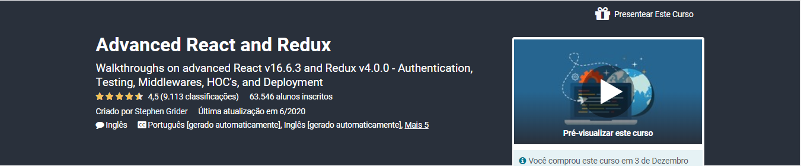

<h1 align="center">
    
</h1>

<h4 align="center">
  🚀 Advanced React and Redux - Stephen Grider
</h4>

## 💻 Course

Course content so far is both comprehensive and thorough. Stephen takes the time to explain his inner thoughts while setting up the development environment and writing code. Additionally, he uses object diagrams to define and show execution flow. I have found the use of such diagrams helpful to stay focused on what needs to be implemented in both writing test cases and the functions/classes themselves.

<h1 align="center">
    
</h1>

## 🔖 Cerificate

<h1 align="center">
    
</h1>

## :rocket: What i've learned

#### The curriculum of the course is on this [Link](https://www.udemy.com/course/react-redux-tutorial/) and i've watched every single one of these beautifull productions. I could hear Stephen's voice on my sleep.
---

Made with ♥ by Scarpellini :shipit: 